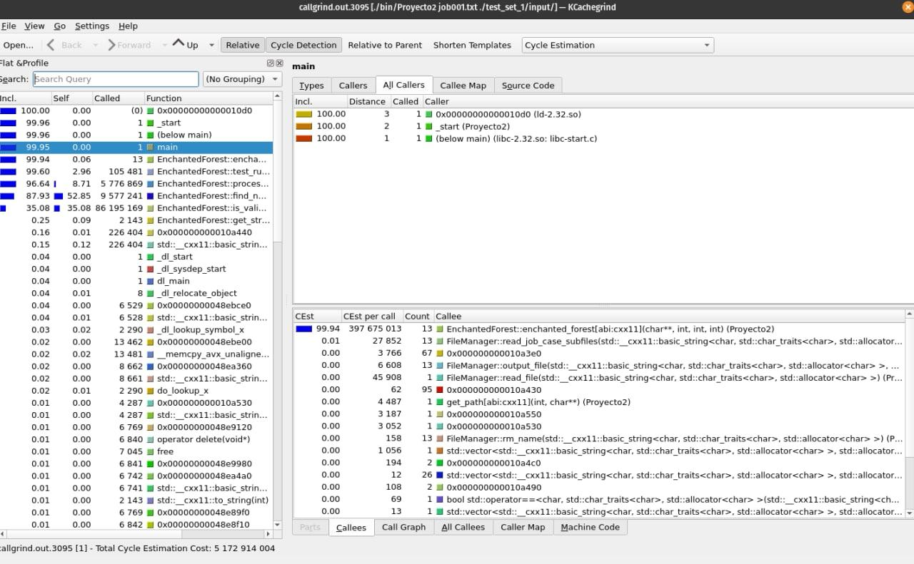
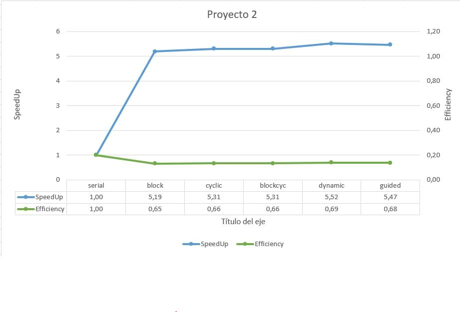
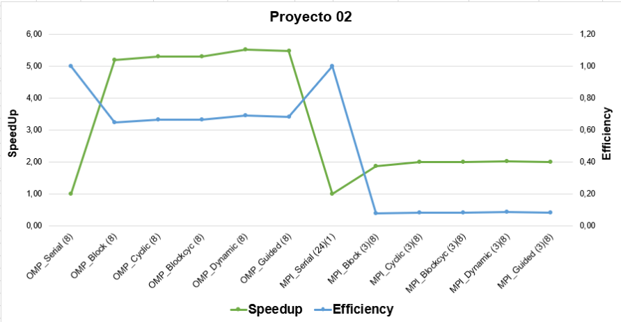

#  **Analisis de Codigo**
## **Comparacion del serial con los distintos mapeos**
* **Rendimiento del codigo antes de la optimizacion**
-Corrida del serial: 6966.47 s

* **Analisis del codigo**

Podemos obervar que el metodo que el test_rules consume mucho para la computadora debido a los metodos que invoca, por lo tanto, este metodo termina siendo muy costoso. Lo mejor para esta implementacion sería hacer este metodo paralelo de tal manera que los hilos se repartan esta cantidad de trabajo entre todos, por lo que decidimos dividir el **trabajo por filas**. Por ejemplo, en caso de que un mapa tenga un dimension de 1000 x 1000, los hilos se repartirán las filas de forma más equitativa. 
* **Modificaciones necesarias para mejorar el rendimiento**
Se va a utilizar OpenMp para repartir las filas a cada hilo. Este cambio va a suceder dentro del metodo *test_rules* en la clase *EnchantedForest*.
Se va utilizar distintos mapeos para repartir la cantidad de filas. Los mapeos son los siguientes:
    1. *Block*
    2. *Cyclic*
    3. *Block-Cyclic*
    4. *Dynamic*
    5. *Guided*
* **Redimiento del codigo despues de la optimizacion**
    1. Corrida de Mapeo por Block: 1342.02 s
    1. Corrida de Mapeo por Cyclic: 1312.59 s
    1. Corrida de Mapeo por Block-Cyclic: 1312.46 s
    1. Corrida de Mapeo por Dynamic: 1263.00 s
    1. Corrida de Mapeo por Guided: 1274.63 s

* **Lecciones aprendidas**
Gracias a la reparticion por fila de los hilos se disminuye en gran medida el tiempo, debido a que el hilo principal no tiene que hacer todo el trabajo solo.
## **Analisis del Grafico_Avance_01**

En el grafico podemos deducir que los mapeos de tipo estatico son los que obtuvieron peor eficiencia, esto puede pasar debido a que el trabajo es completamente equitativo, debido a que puede haber un caso donde un hilo tiene que hacer varias filas muy complicadas mientras que al resto le tocan filas mas simples.
A diferencia del mapeo de tipo dinamico, donde cada hilo agarra un mapa apenas termina de hacer su trabajo, esto resulta más equitativo debido a que ningun hilo se sobrecarga de trabajo, por esta misma razon, el mapeo de tipo dinamico obtuvo mejor eficienca, debido a que los filas no estan distribuidos de ninguna manera, entonces, si cada hilo es capaz de agarrar una fila nueva apenas termina su trabajo la reparticion termina siendo mas equitativa para cada hilo.

## **Analisis del Grafico_Avance_02**

Podemos observar que la implementacion del OpenMp por si solo resulta ser más lento que con la implementacion del MPI.

Despues de haber corrido las distintas implementaciones que se requieren para la creación del gráfico, con el caso *job002.txt* se puede ver como la implementacion del MPI/OpenMp mejora siginificativamente la velocidad, esto pasa debido a que cada proceso corre dentro de un nodo esclavo distinto del cluster Arenal, estos nodos se reparten la cantidad de mapas dentro del *job002.txt*, y como cada nodo tiene 8 nucleos la parte de OpenMp puede crear 8 hilos en cada proceso para repartirse el trabajo de cada mapa, esto se ve reflejado en el gran incremento de velocidad.

Como conclusiones en cuanto a la comparación del programa con OMP y MPI, podemos resaltar que este último castiga la eficiencia del programa debido a lo caro que es utilizar más nucleos del computador y que cada núcleo utilice hilos. Además, comparando la el programa MPI_Serial que utiliza 24 procesos con las implemetaciones de MPI/OpenMp podemos notar que es más lento, y además, es más caro para el computador ejecutar 24 procesos a dividir 3 procesos con 8 hilos, dando estos un mejor tiempo pero utilizando todos los recursos del computador.

En el grafico pareciera que la version OpenMp es más rápido, pero esto pasa debido a dos cosas, primero debido a que la version serial del OpenMp dura mucho tiempo y por esto mismo esta version con hilos presenta una mejora gigantezca, mientras que la version serial del MPI ya de por sí sola es mucho más rápida que la del OpenMp y por esto mismo su version de MPI son hilos no pueden presentar tanta mejoría en tiempo con respecto a la serial.