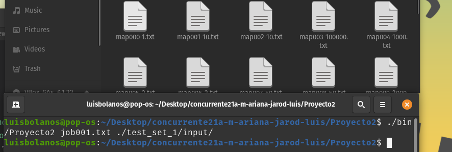

# Como compilar el programa

## Manual De Usuario Para Compilar Sin MPI

Para compilar el programa debemos de seguir los siguientes pasos:

* Abrir la terminal en el folder donde se encuentren los ejecutables.

* Una vez en la terminal debemos escribir el comando make para compilar el programa.

* Si el programa fue compilado con exito veremos que no nos tirara errores y en la carpeta bin se encontrara el ejecutable.

* EL programa tiene dos parametros, el primero que es el nombre del job que se quiere correr, y el segundo el cual corresponde al path donde se encuentra dicho archivo

* Para ejecurtar el programa escirbiremos lo siguiente en la terminal ***./bin/Proyecto2 job001.txt ./test_set_1/input/***

* Es importante recordar que todos los archivos que se desean correr (los cuales se encuentran en el job), deben de estar en la misma carpeta que el job, de lo contrario el programa producira una salida diciendo que no pudo leer el archivo y se detendra.

* El programa crea archivos .txt basados en los que el usuario tenga en su job, estos archivos se encuentran en la misma carpeta en la que se abre la terminal.

## Manual De Usuario Para Compilar Con MPI
Para compilar el programa debemos de seguir los siguientes pasos:

* Abrir la terminal en el folder donde se encuentren los ejecutables.

* Una vez en la terminal debemos escribir el comando make para compilar el programa.

* Si el programa fue compilado con exito veremos que no nos tirara errores y en la carpeta bin se encontrara el ejecutable.

* EL programa tiene dos parametros, el primero que es el nombre del job que se quiere correr, y el segundo el cual corresponde al path donde se encuentra dicho archivo

* Para ejecurtar el programa escirbiremos lo siguiente en la terminal ***mpiexec-n 3 ./bin/Proyecto2 job002.txt ./test_set_1/input/ 8*** Nota: el 3 es la cantidad de procesos que quisimos utilizar en esta prueba, pero el usuario puede colocar la cantidad que desea.
* 

* Es importante recordar que todos los archivos que se desean correr (los cuales se encuentran en el job), deben de estar en la misma carpeta que el job, de lo contrario el programa producira una salida diciendo que no pudo leer el archivo y se detendra.

* El programa crea archivos .txt basados en los que el usuario tenga en su job, estos archivos se encuentran en la misma carpeta en la que se abre la terminal.

## Manual De Usuario Para Compilar Con MPI en el Cluster Arenal
Para compilar el programa debemos de seguir los siguientes pasos:

* Abrir la terminal en el folder donde se encuentren los ejecutables.

* Una vez en la terminal debemos escribir el comando make para compilar el programa.

* Si el programa fue compilado con exito veremos que no nos tirara errores y en la carpeta bin se encontrara el ejecutable.

* EL programa tiene dos parametros, el primero que es el nombre del job que se quiere correr, y el segundo el cual corresponde al path donde se encuentra dicho archivo

* Para ejecurtar el programa escirbiremos lo siguiente en la terminal ***mpiexec-n 3 -f ./host/host.txt ./bin/Proyecto2 job002.txt /share/apps/cursos/paralela/proy02/test_set_2/ 8*** Nota: el 3 es la cantidad de procesos que quisimos utilizar en esta prueba, pero el usuario puede colocar la cantidad que desea, además, el archivo *host.txt* le indica a MPI que el programa se desea correr en los tres nodos esclavos de Arenal.
* 

* Es importante recordar que todos los archivos que se desean correr (los cuales se encuentran en el job), deben de estar en la misma carpeta que el job, de lo contrario el programa producira una salida diciendo que no pudo leer el archivo y se detendra.

* El programa crea archivos .txt basados en los que el usuario tenga en su job, estos archivos se encuentran en la misma carpeta en la que se abre la terminal.